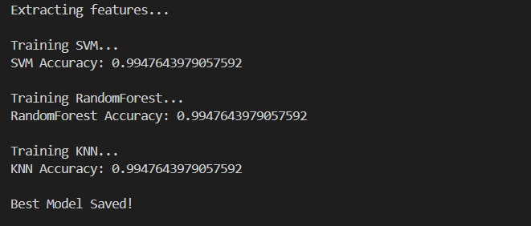
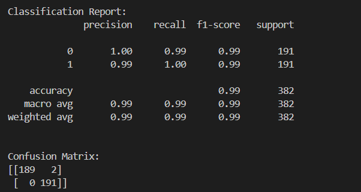
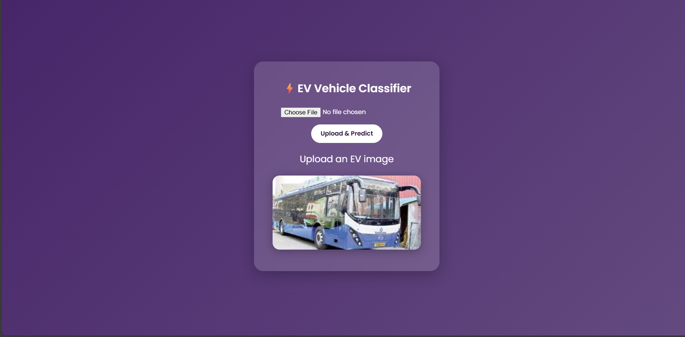
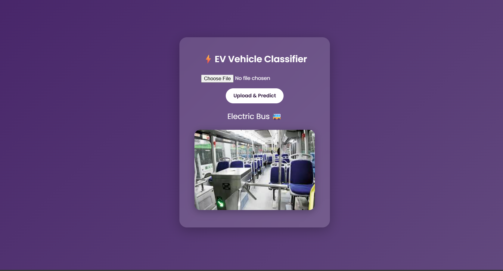

# 🚗⚡ EV Vehicle Classification (Bus vs Car)

A Machine Learning project that classifies Electric Vehicles into **Electric Bus** or **Electric Car** using supervised learning algorithms.

This project compares multiple ML models, evaluates their performance, selects the best-performing model, and validates its effectiveness on unseen test data.

---

## 📌 Project Overview

This project builds a classification system that predicts whether a vehicle is:

- 🚌 **Electric Bus**
- 🚘 **Electric Car**

---

## 🧠 Models Implemented

The following supervised learning algorithms were trained and evaluated:

1. **Support Vector Machine (SVM)**
2. **Random Forest Classifier**
3. **K-Nearest Neighbors (KNN)**

All models were trained using the same dataset and preprocessing pipeline to ensure a fair comparison.

---

## ⚙️ Tech Stack

- Python
- tensorflow
- opencv-python
- numpy
- scikit-learn
- flask
- joblib

---

## 🔄 Workflow

1. Data Collection & Cleaning  
2. Feature Engineering  
3. Train-Test Split  
4. Model Training (SVM, RF, KNN)  
5. Accuracy Comparison  
6. Model Selection  
7. Final Testing & Validation  

## 📈 Evaluation Metrics

The selected model was evaluated using:

- Accuracy Score  
- Confusion Matrix  
- Precision  
- Recall  
- F1-Score  

---

## 📷 Output Screenshots

### 🔹 Model Accuracy Comparison

### 🔹 Classification summary

### 🔹 Final Prediction Output

---

## 🚀 How to Run

1. Clone the repository:

git clone https://github.com/Roshnitm/EV_Classification_model.git

cd ev-vehicle-classification

2. Install dependencies:

pip install -r requirements.txt

3. Run training:

python train.py

4. Run testing:

python test.py

5. Run app.py:

python app.py

---

## 🎯 Key Highlights

✔ Compared multiple supervised ML models  
✔ Performed structured evaluation  
✔ Selected best-performing model  
✔ Achieved high classification accuracy  
✔ Clean and reproducible pipeline  

